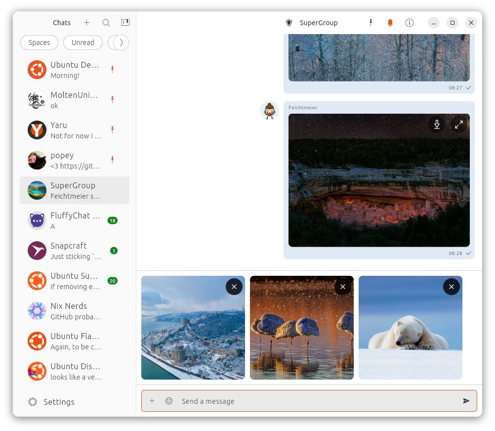

# Nebuchadnezzar - Matrix Client written in Dart & Flutter for Linux

## Install

[](https://snapcraft.io/nebuchadnezzar)



## Build yourself

### Linux setup

#### Install flutter

[How to install flutter](https://docs.flutter.dev/get-started/install)

#### Install system dev libraries for persistence, encryption and notifications

```
sudo apt install libcrypto++-dev libsecret-1-dev libjsoncpp-dev libnotify-dev  libjsoncpp1 libsecret-1-0 librhash0 libwebkit2gtk-4.0-dev libssl-dev libpciaccess-dev
```

#### Run

`flutter run`

or

`sudo snap install code --classic`

&

[vscode dart extension](https://marketplace.visualstudio.com/items?itemName=Dart-Code.dart-code)


### web setup (for development)

Run scripts/prepare-web.sh

### macos

cp /Users/frederik/Downloads/libcrypto.1.1.dylib ~/Projects/nebuchadnezzar/build/macos/Build/Products/Debug/nebuchadnezzar.app/Contents/Frameworks             


## Credits: Fluffy-Chat

The bootstrap UI, the HTML message, the room permission logic and the english translations are copied and modified from the fluffy-chat repository.
Thank you for your awesome dart sdk!

## Why this name?

The name is inspired by the traveling vehicle from the movie Matrix, which uses the name of https://en.wikipedia.org/wiki/Nebuchadnezzar_II the second king of Babylon!

